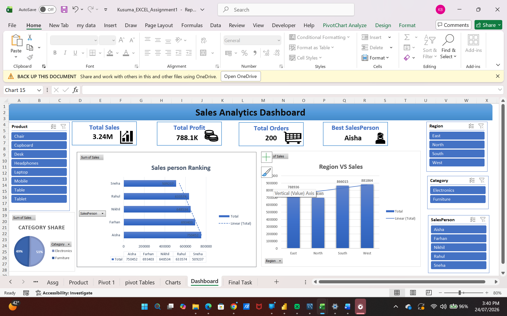

# Sales-KPI-Dashboard-Excel
**Project Overview**

This project is an interactive Sales KPI Dashboard created using Microsoft Excel. It analyzes sales data and presents key business metrics through charts, PivotTables, KPI cards, and slicers to help users understand sales performance and make informed decisions.

**Tools Used**
Microsoft Excel
Pivot Tables
Pivot Charts
Slicers
Excel Formulas
Conditional Formatting

**Dashboard Features**
Interactive Dashboard
KPI Cards
Sales Trend Analysis
Product Performance
Category-wise Sales
Customer Analysis
Salesperson Performance

**Key KPIs**
Total Sales
Total Profit
Total Orders
Top Performing Salesperson

**</> Markdown**
**Project Files**

Dataset.xlsx
[Sales_KPI_Dashboard](SalesDashboard.xlsx)

Interactive Sales KPI Dashboard built in Microsoft Excel featuring data analysis, KPI tracking, PivotTables, PivotCharts, slicers, and business insights.
